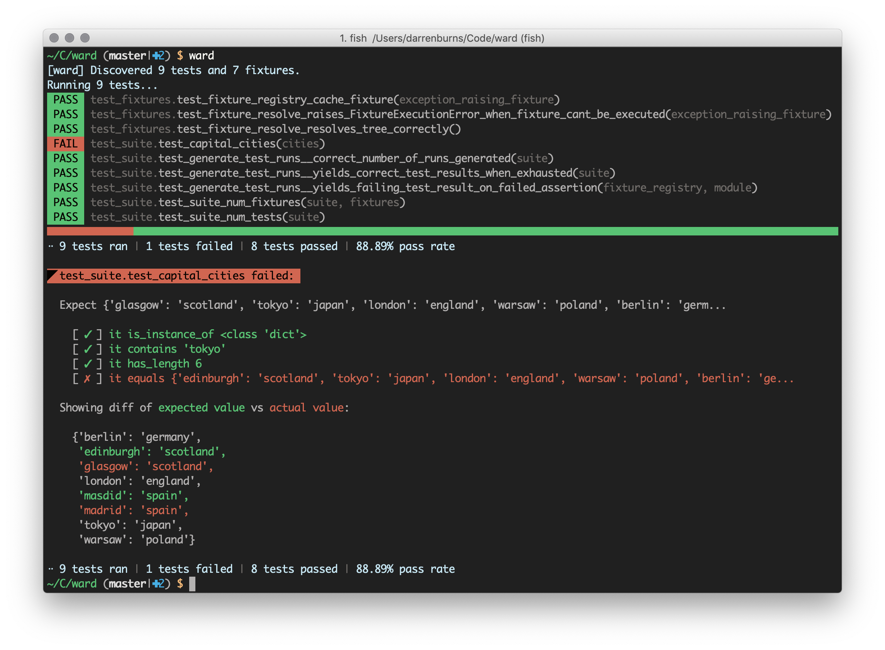

# Ward

An experimental test runner for Python that supports pytest-style fixtures. This project is a work in progress, and is not production ready.



## Example

```python
# Define a fixture
@fixture
def one():
    return 1
    
# Inject fixtures into each other
@fixture
def two(one)
    return one + one

# Inject fixtures into tests
def test_one_plus_two_equals_three(one, two):
    expect(one + two).equals(3)
```