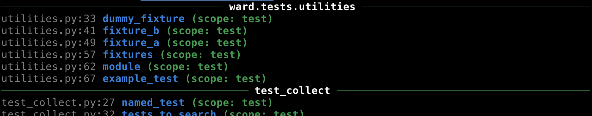
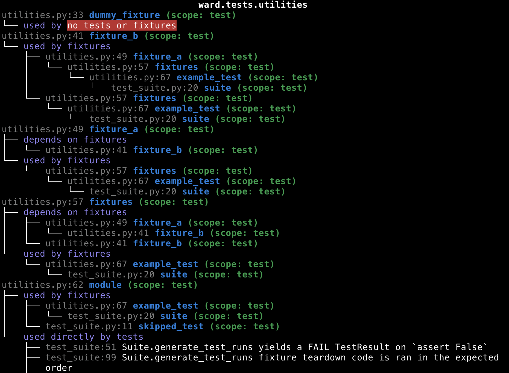

.. _fixtures:

Fixtures
========

A `fixture` is a function that provides tests with the data they need in order to run.

They provide a modular, composable alternative to ``setup``/``before*`` and ``teardown``/``after*`` methods that appear in many test frameworks.

Declaring and using a simple fixture
------------------------------------

We can declare a fixture using the ``@fixture`` decorator. Let's define a fixture that represents a user on a website.

.. code-block:: python

    from ward import fixture

    @fixture
    def user():
        return User(id=1, name="sam")

Now lets add a test that will make use of the user fixture.

.. code-block:: python

    from ward import test

    @test("fetch_user_by_id should return the expected User object")
    def _(expected_user=user):
        fetched_user = fetch_user_by_id(id=expected_user.id)
        assert fetched_user == expected_user

By directly binding the fixture as a default argument to our test function, we've told Ward to resolve the fixture and inject it into our test.
Inside our test, the variable ``expected_user`` is the object ``User(id=1, name="sam")``.

The ``@using`` decorator
------------------------

An alternative approach to injecting fixtures into tests is the ``@using`` decorator.

This approach lets us use positional arguments in our test signature, and declare which fixture each argument refers to using the decorator.

Here's how we'd inject our user fixture into a test with using:

.. code-block:: python

    from ward import expect, test, using

    @test("fetch_user_by_id should return the expected User object")
    @using(expected_user=user)
    def _(expected_user):
        fetched_user = fetch_user_by_id(id=expected_user.id)
        assert fetched_user == expected_user

In the example above, we tell Ward to bind the resolved value of the user fixture to the expected_user position argument.

Fixture scope
-------------

By default, a fixture is executed immediately before each test it is injected into.

If the code inside your fixtures is expensive to execute, it may not be practical to have it run before every test that depends on it.

To solve this problem, Ward lets you give a `"scope"` to your fixtures. The scope of a fixture determines how long it is cached for.

Ward supports 3 scopes: ``test`` (default), ``module``, and ``global``.

* A test scoped fixture will be evaluated at most once per test.
* A module scoped fixture will be evaluated at most once per module.
* A global scoped fixture will be evaluated at most once per invocation of ward.

To make the user fixture global scope, we can change the decorator call to ``@fixture(scope=Scope.Global)``.

.. code-block:: python

    from ward import fixture, Scope

    @fixture(scope=Scope.Global)  # @fixture(scope="global") also works
    def user():
        return User(id=1, name="sam")

This fixture will be executed and cached the first time it is injected into a test.

Because it has a global scope, Ward will pass the cached value into all other tests that use it.

If user instead had a scope of ``Scope.Module``, then Ward would re-evaluate the fixture when it's required by a test in any other module.

Careful management of fixture scope can drastically reduce the time and resources required to run a suite of tests.

As a general rule of thumb, if the value returned by a fixture is immutable, or we know that no test will mutate it, then we can make it global.

Warning: You should never mutate a global or module scoped fixture. Doing so breaks the isolated nature of tests, and introduces hidden dependencies between them. Ward will warn you if it detects a global or module scoped fixture has been mutated inside a test (coming in v1.0).

Fixture composition
-------------------

Fixtures can be composed by injecting them into each other.

You can inject a fixture into another fixture in the same way that you'd inject it into a test: by binding it as a default argument.

.. code-block:: python

    @fixture
    def name():
        return "sam"

    @fixture
    def user(name=name):
        return {"name": name}

    @test("fixtures can be composed")
    def _(name=name, user=user):
        assert user["name"] == name

In the example above, user depends on name, and the test depends on both user and name.
Both fixtures are test scoped, so they are evaluated at most once per test.
This means that the name instance that Ward passes into user is the same instance it passes into the test.

.. code-block:: text

    PASS test_composition:14: fixtures can be composed

Running teardown code
---------------------

Fixtures have the ability to cleanup after themselves.

For a fixture to run teardown code, it must be declared as a `generator function`.

Notice how we ``yield`` the value of the fixture in the test below.
Ward will inject the yielded value into the test, and after the test has run, all code below the ``yield`` will be executed.

.. code-block:: python

    from ward import test, fixture

    @fixture
    def database():
        print("1. I'm setting up the database!")
        db_conn = setup_database()
        yield db_conn
        db_conn.close()
        print("3. I've torn down the database!")

    @test(f"Bob is one of the users contained in the database")
    def _(db=database):
        print("2. I'm running the test!")
        users = get_all_users(db)
        assert "Bob" in users

The output captured by Ward whilst the test above runs is:

1. I'm setting up the database!
2. I'm running the test!
3. I've torn down the database!

Global and module scoped fixtures can also contain teardown code:

* In the case of a module scoped fixture, the teardown code will run after the test module completes.
* In the case of a global scoped fixture, the teardown code will run after the whole test suite completes.
* If an exception occurs during the setup phase of the fixture, the teardown phase will not run.
* If an exception occurs during the running of a test, the teardown phase of any fixtures that that test depends on will run.

Inspecting fixtures
-------------------

You can view all of the fixtures in your project using the ``ward fixtures`` command.

To view the dependency graph of fixtures, and detect fixtures that are unused, you can run ``ward fixtures --show-dependency-trees``:

