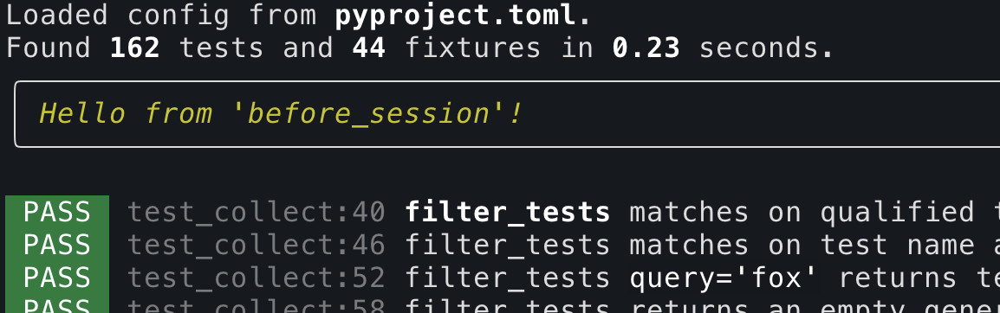
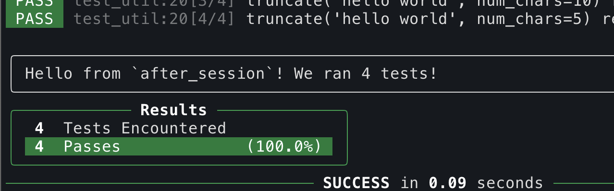

.. _extending_ward:

Extending Ward
##############

Ward calls a series of *hook* functions throughout a test session. You can provide your own implementations of these hooks
in order to extend Ward's behaviour. The full list of hook functions that Ward calls, along with examples of how you can implement them,
are listed in ":ref:`hook_list`".

Ward uses pluggy, which is the same plugin framework used by pytest. The `pluggy docs <https://pluggy.readthedocs.io/en/latest/>`_ offer deeper insight into
how the plugin system works, as well as some more advanced options.

.. note::

    Where the pluggy docs refer to ``@hookimpl``, that's what Ward calls ``@hook``.

User supplied configuration
****************************

When you write a plugin, users need to be able to provide some configuration to customise it to suit their needs.

Each Ward plugin gets it's own section of the ``pyproject.toml`` configuration file. Say your plugin on PyPI is called ``ward-bananas``, then
your users will be able to configure your plugin by adding values to the ``[tool.ward.plugins.bananas]`` sections:

.. code-block:: toml

    [tool.ward.plugins.bananas]
    num_bananas = 3

In your plugin you can examine the configuration supplied by the user through the ``Config`` object. Here's an example of how we'd read
the configuration above.

.. code-block:: python

    @hook
    def before_session(config: Config) -> Optional[ConsoleRenderable]:
        # Get all the config the user supplied for our plugin `ward-bananas`
        banana_config: Dict[str, Any] = config.plugin_config.get("bananas", {})
        # Get the specific config item `num_bananas`
        num_bananas = banana_config.get("num_bananas")
        # Make use of our config value to customise our plugin's behaviour!
        if num_bananas:
            print("banana" * num_bananas)

.. _hook_list:

What hooks are available?
*************************

You can write implement these hooks inside the project you're testing, or inside a separate package. You can upload your package to PyPI in
order to share it with others.

If you implement the hooks inside your test project, you'll need to register them in your ``pyproject.toml`` config file, so
that Ward knows where to find your custom implementations:

.. code-block:: toml

    hook_module = ["module.containing.hooks"]

If you write them in a separate Python package (i.e., a plugin), then the hooks will be registered automatically, as explained in ":ref:`package_code_into_plugin`".

Run code *before* the test run with ``before_session``
======================================================

.. automethod:: ward.hooks::SessionHooks.before_session
    :noindex:

Example: printing information to the terminal
---------------------------------------------

Here's how you could implement a hook in order to achieve the outcome shown above.

.. code-block:: python

    from rich.console import RenderResult, Console, ConsoleOptions, ConsoleRenderable
    from ward.config import Config
    from ward.hooks import hook

    @hook
    def before_session(config: Config) -> Optional[ConsoleRenderable]:
        return WillPrintBefore()

    class WillPrintBefore:
        def __rich_console__(
            self, console: Console, console_options: ConsoleOptions
        ) -> RenderResult:
            yield Panel(Text("Hello from 'before session'!", style="info"))

Run code *after* the test run with ``after_session``
====================================================

.. automethod:: ward.hooks::SessionHooks.after_session
    :noindex:

Example: printing information about the session to the terminal
---------------------------------------------------------------

Here's how you could implement a hook in order to achieve the outcome shown above.

.. code-block:: python

    from typing import Optional, List

    from rich.console import RenderResult, Console, ConsoleOptions, ConsoleRenderable
    from rich.panel import Panel
    from rich.text import Text
    from ward.config import Config
    from ward.hooks import hook
    from ward.models import ExitCode
    from ward.testing import TestResult

    @hook
    def after_session(
        config: Config, results: List[TestResult], exit_code: ExitCode
    ) -> Optional[ConsoleRenderable]:
        return SummaryPanel(test_results)

    class SummaryPanel:
        def __init__(self, results: List[TestResult]):
            self.results = results

        @property
        def time_taken(self):
            return sum(r.test.timer.duration for r in self.results)

        def __rich_console__(
            self, console: Console, console_options: ConsoleOptions
        ) -> RenderResult:
            yield Panel(
                Text(f"Hello from `after_session`! We ran {len(self.results)} tests!")
            )

Filter, sort, or modify collected tests with ``preprocess_tests``
=================================================================

.. automethod:: ward.hooks::SessionHooks.preprocess_tests
    :noindex:

Example: tagging tests that span many lines
-------------------------------------------

In the code below, we implement ``preprocess_tests`` to automatically tag "big" tests which contain more than 15 lines of code.

.. code-block:: python

    @hook
    def preprocess_tests(self, config: Config, collected_tests: List[Test]):
        """
        Attaches a tag 'big' to all tests which contain > 15 lines
        """
        for test in collected_tests:
            if len(inspect.getsourcelines(test.fn)[0]) > 15:
                test.tags.append("big")

With this hook in place, we can run all tests that we consider "big" using ``ward --tags big``. We can also run tests that we don't consider
to be "big" using ``ward --tags 'not big'``.

.. _package_code_into_plugin:

Packaging your code into a plugin
**********************************

A *plugin* is a collection of hook implementations that come together to provide some functionality which can be shared with others.

If you've wrote implementations for one or more of the hooks provided by Ward, you can share those implementations
with others by creating a plugin and uploading it to PyPI.

Others can then install your plugin using a tool like ``pip`` or ``poetry``.

After they install your plugin, the hooks within will be registered automatically (no need to update any config).

Here's an example of a ``setup.py`` file for a plugin called ``ward-html``:

.. code-block:: python

    from distutils.core import setup

    setup(
        # The name must start with 'ward-'
        name="ward-html",
        # The version of your plugin
        version="0.1.0",
        # The plugin code lives in a single module: ward_html.py
        py_modules=["ward_html"],
        # Ward only supports 3.6+
        python_requires=">=3.6",
        # Choose the version of ward you wish to target
        install_requires=[
            "ward>=0.57.0b0",
        ],
        # IMPORTANT! Adding the 'ward' entry point means your plugin
        # will be automatically registered. Users will only need to
        # "pip install" it, and it will work having to specify it in
        # a config file or anywhere else.
        entry_points={"ward": ["ward-html = ward_html"]},
    )

This is a minimal example. `This page <https://docs.python.org/3/distutils/setupscript.html>`_ on the
official Python docs offers more complete coverage on all of the functionality offered by ``setuptools``.
