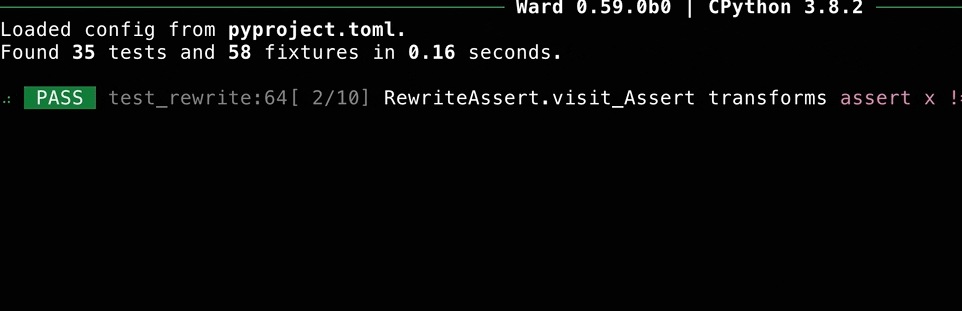
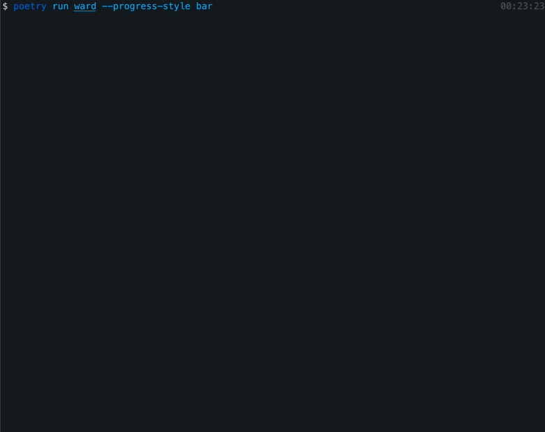
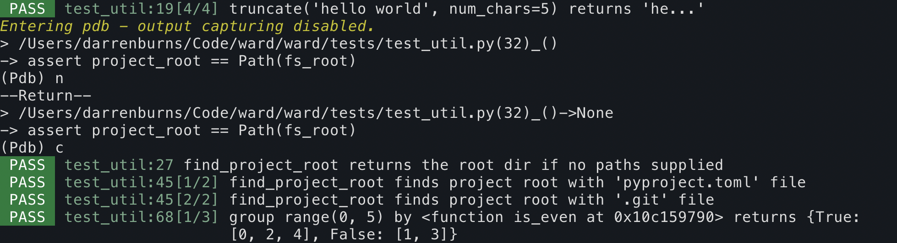

.. _running_tests:

Running Tests via the CLI
=========================

To find and run tests in your project, you can run ``ward`` without any arguments.

This will recursively search through the project for modules with a name starting with ``test_`` or ending with ``_test``,
and execute any tests contained in the modules it finds.

Test outcomes
-------------

A test in Ward can finish with one of several different outcomes.
The outcome of a test will be clearly indicated during the run, and a summary of those outcomes is displayed after the
run completes or is cancelled.

* ``PASS``: The test passed. It completed without any exceptions occurring or assertions failing.
* ``FAIL``: The test failed. An exception occurred or an assertion failed.
* ``SKIP``: The test was skipped. It wasn't executed at all because it was decorated with ``@skip``.
* ``XFAIL``: An expected failure. The test is decorated with ``@xfail``, indicating that we currently expect it to fail... and it did!
* ``XPASS``: An unexpected pass. The test is decorated with ``@xfail``, indicating that we expected it to fail. However, the test passed unexpectedly.
* ``DRYRUN``: The status is only used during a dry-run (using the ``--dry-run`` option). The test nor any injected fixtures were executed.

Specifying test paths with ``--path``
-------------------------------------

You can run tests in a specific directory or module using the ``--path`` option. For example, to run all tests inside a directory named ``tests``: ``ward --path tests``.

To run all the tests in your project, you can just type ``ward`` from anywhere inside your project.

Ward considers your project to be the directory containing your ``pyproject.toml`` config file and all directories within. If you don't have a ``pyproject.toml`` file, then
Ward will look for a ``.git`` or ``.hg`` folder/file and consider that as your project root.

If Ward cannot find a project root, the running ``ward`` without a ``--path`` is equivalent to running ``ward --path .``.

You can directly specify a test module, for example: ``ward --path tests/api/test_get_user.py``.

You can supply multiple test directories by providing the ``--path`` option multiple times: ``ward --path "unit" --path "integration"``.

Ward will run all tests it finds across all given paths. If one of the specified paths is contained within another, they'll only be included once. Ward will only run a test once per session.

Excluding modules or paths with ``--exclude``
---------------------------------------------

You can tell Ward to ignore specific modules or directories using the ``--exclude`` command line option. For example:

``ward --exclude path/to/dir1 --exclude path/to/dir2``

You can also exclude paths using ``pyproject.toml``:

.. code-block:: toml

   [tool.ward]
   exclude = ["tests/resources", "tests/utilities.py"]

Selecting tagged tests with ``--tags``
--------------------------------------

You can select which tests to run based on a "test expressions" using the ``--tags`` option: ``ward --tags EXPR``.

A tag expression is an infix boolean expression that can be used to accurately select a subset of tests you wish to execute.
Tests are tagged using the tags keyword argument of the ``@test`` decorator (e.g. ``@test("eggs are green", tags=["unit"])``.)

For example, if you wanted to run all tests tagged with either ``android`` or ``ios``, run ``ward --tags "android or ios"``.

Here are some examples of tag expressions and what they mean:

* ``slow``: tests tagged with ``slow``
* ``unit and integration``: tests tagged with both ``unit`` and ``integration``
* ``big and not slow``: tests tagged with ``big`` that aren't also tagged with ``slow``
* ``android or ios``:	tests tagged with either ``android`` or ``ios``

You can use parentheses in tag expressions to change the precedence rules to suit your needs.

Loosely search for tests with ``--search``
------------------------------------------

You can choose to limit which tests are collected and ran by Ward using the ``--search`` option. Module names, test descriptions and test function bodies will be searched, and those which contain the argument will be ran.

Here are some examples:

* Run all tests that call the ``fetch_users`` function: ``ward --search "fetch_users("``
* Run all tests that check if a ``ZeroDivisionError`` is raised: ``ward --search "raises(ZeroDivisionError)"``
* Run all tests decorated with the ``@xfail`` decorator: ``ward --search "@xfail"``
* Run a test described with ``"my_function should return False"``: ``ward --search "my_function should return False"``
* Running tests inside a module: The search takes place on the fully qualified name, so you can run a single module (e.g. my_module) using the following command: ``ward --search my_module.``

Of course, if a test name or body contains the string ``"my_module."``, that test will also be selected and will run.

This approach is useful for quickly running tests which match a simple query, making it useful for development.

Customising the output with ``--test-output-style``
---------------------------------------------------

As your project grows, it may become impractical to print each test result on its own line. Ward provides alternative test output styles that can be configured using the ``--test-output-style`` option.

``ward --test-output-style [test-per-line|dots-module|dots-global|live]``

``test-per-line`` (default)
^^^^^^^^^^^^^^^^^^^^^^^^^^^

The default test output of Ward looks like this (``--test-output-style=test-per-line``):

``dots-module``
^^^^^^^^^^^^^^^

If you run Ward with ``--test-output-style=dots-module``, each module will be printed on its own line, and a single character will be used to represent the outcome of each test in that module:

``dots-global``
^^^^^^^^^^^^^^^

If that is still too verbose, you may wish to represent every test outcome with a single character, without grouping them by modules (``--test-output-style=dots-global``):

``live``
^^^^^^^^

Using ``--test-output-style=live`` will cause Ward to output results in the format shown below.

Displaying test session progress with ``--progress-style``
----------------------------------------------------------

Ward offers two ways of informing you of progress through a test run: inline progress percentage (on by default), and/or a dynamic progress bar.

By default, the percentage progress through a test run will appear at the right hand side of the output, which corresponds to ``--progress-style inline``.

You can also have Ward display a dynamic progress bar during the test run, using the ``--progress-style bar`` option.

If you wish, can pass supply ``--progress-style`` with multiple times (to display a progress bar and inline progress, for example).

.. warning::

    The progress bar is currently only available with the default output mode (``--test-output-style test-per-line``).

Output capturing
----------------

By default, Ward captures everything that is written to stdout and stderr as your tests run.
If a test fails, everything that was printed during the time it was running will be printed as part of the failure output.

With output capturing enabled, if you run a debugger such as pdb during test execution, everything it writes to the stdout will be captured by Ward too.

Disabling output capturing with ``--no-capture-output``
^^^^^^^^^^^^^^^^^^^^^^^^^^^^^^^^^^^^^^^^^^^^^^^^^^^^^^^

If you wish to disable output capturing you can do so using the ``--no-capture-output`` flag on the command line.
Anything printed to stdout or stderr will no longer be captured by Ward, and will be printed to the terminal as your tests run,
regardless of outcome.

You can also disable output capturing using the ``capture-output`` config in your ``pyproject.toml``:

.. code-block:: toml

    [tool.ward]
    capture-output = false

Randomise test execution order with ``--order random``
------------------------------------------------------

Use ``--order "random"`` when running your tests to have Ward randomise the order they run in: ``ward --order "random"``.

Running tests in a random order can help identify tests that have hidden dependencies on each other.
Tests should pass regardless of the order they run in, and they should pass if run in isolation.

To have Ward always run tests in a random order, use the ``order`` config in your ``pyproject.toml``:

.. code-block:: toml

    [tool.ward]
    order = "random"

Cancelling after a number of failures with ``--fail-limit``
-----------------------------------------------------------

If you wish for Ward to cancel a run immediately after a specific number of failing tests, you can use the ``--fail-limit`` option. To have a run end immediately after 5 tests fail:

``ward --fail-limit 5``

Finding slow running tests with ``--show-slowest``
--------------------------------------------------

Use ``--show-slowest N`` to print the N tests with the highest execution time after the test run completes.

Performing a dry run with ``--dry-run``
---------------------------------------

Use the ``--dry-run`` option to have Ward search for and collect tests without running them (or any fixtures they depend on).
When using ``--dry-run``, tests will return with an outcome of ``DRYRUN``.

This is useful for determining which tests Ward would run if invoked normally.

Format strings in test descriptions may not be resolved during a dry-run, since no fixtures are evaluated and the data may therefore be missing.

Displaying symbols in diffs with ``--show-diff-symbols``
--------------------------------------------------------

Use ``--show-diff-symbols`` when invoking ``ward`` in order to have the diff output present itself with symbols instead
of the colour-based highlighting. This may be useful in a continuous integration environment that doesn't support coloured terminal
output.

Debugging your code with ``pdb``/``breakpoint()``
-------------------------------------------------

Ward will automatically disable output capturing when you use `pdb.set_trace()` or `breakpoint()`, and re-enable it when you exit the debugger.

