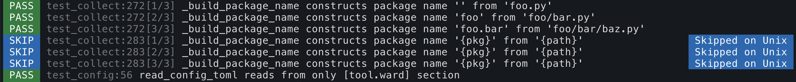

Writing Tests
=============

Descriptive testing
-------------------

Tests aren't only a great way of ensuring your code behaves correctly, they're also a fantastic form of documentation.
Therefore, a test framework should make describing your tests in a clear and concise manner as simple as possible.

Ward lets you describe your tests using strings, allowing you to be as descriptive
as you'd like:

.. code-block:: python

    from ward import test

    @test("simple addition")
    def _():
        assert 1 + 2 == 3

The description of a test is a format string, and may
refer to any of the parameters (variables or fixtures) present in the test signature. This
makes it easy to keep your test data and test descriptions in sync:

.. code-block:: python

    @fixture
    def three():
        yield 3

    @test("{a} + {b} == {result}")
    def _(a=1, b=2, result=three):
        assert a + b == result

During the test run, Ward will print the test description to the console.

Tests will only be collected from modules with names that start with `"test_"` or end with `"_test"`.

Tagging tests
-------------

You can tag tests using the ``tags`` keyword argument of the ``@test`` decorator:

.. code-block:: python

    @test("simple addition", tags=["unit", "regression"])
    def _():
        assert 1 + 2 == 3

Tags provide a powerful means of grouping tests and associating queryable metadata with them.

When running your tests, you can filter which ones you want to run using tag expressions.

Here are some ways you could use tags:

* Linking a test to a ticket from an issue tracker: `"BUG-123"`, `"PULL-456"`, etc.
* Describe what type of test it is: `"small"`, `"medium"`, `"big"`, `"unit"`, `"integration"`, etc.
* Specify which endpoint your test calls: `"/users"`, `"/tweets"`, etc.
* Specify which platform a test targets: `"windows"`, `"unix"`, `"ios"`, `"android"`

With your tests tagged you can now run only the tests you care about. To ask Ward to run only
integration tests which target any mobile platform, you might invoke it like so:

``ward --tags "integration and (ios or android)"``

For a deeper look into tag expressions, see the :ref:`running tests<running_tests>` page.

Using ``assert`` statements
---------------------------

Ward lets you use plain ``assert`` statements when writing your tests, but gives you considerably
more information should the assertion fail than a typical `assert` statement. It does this by
modifying the abstract syntax tree (AST) of any collected tests. Occurrences of the `assert`
statement are replaced with a function call, depending on which comparison operator was used.

Currently, Ward only rewrites ``assert`` statements that appear directly in the body of your tests.
If you use helper methods that contain ``assert`` statements and would like detailed output, you can
use the helper ``assert_{op}`` methods from ``ward.expect``.

.. TODO: Make some notes on how this works.

.. _parameterisation:

Parameterised testing
---------------------

A parameterised test is where you define a single test that runs multiple times,
with different arguments being injected on each run.

The simplest way to parameterise tests in Ward is to write your test inside a loop. In each iteration of the loop,
you can pass different values into the test:

.. code-block:: python

    for lhs, rhs, res in [
        (1, 1, 2),
        (2, 3, 5),
    ]:

        @test("simple addition")
        def _(left=lhs, right=rhs, result=res):
            assert left + right == result

You can also make a reference to a fixture and Ward will resolve and inject it:

.. code-block:: python

    @fixture
    def five():
        yield 5

    for lhs, rhs, res in [
        (1, 1, 2),
        (2, 3, five),
    ]:

        @test("simple addition")
        def _(left=lhs, right=rhs, result=res):
            assert left + right == result

Ward also supports parameterised testing by allowing multiple fixtures or
values to be bound as a keyword argument using the ``each`` function:

.. code-block:: python

    from ward import each, fixture, test

    @fixture
    def six():
        return 6

    @test("an example of parameterisation")
    def _(
        a=each(1, 2, 3),
        b=each(2, 4, six),
    ):
        assert a * 2 == b

Although the example above is written as a single test,
Ward will generate and run 3 distinct tests from it at run-time: one for each item passed into `each`.

The variables ``a`` and ``b`` take the values ``a=1`` and ``b=2`` in the first test,
``a=2`` and ``b=4`` in the second test, and the third test will be passed the values ``a=3`` and ``b=6``.

If any of the items inside ``each`` is a fixture, that fixture will be resolved
and injected. Each of the test runs are considered *unique tests* from
a fixture scoping perspective.

.. warning:: All occurrences of ``each`` in a test signature must contain the same number of arguments.

Using ``each`` in a test signature doesn't stop you from injecting other fixtures as normal:

.. code-block:: python

    from ward import each, fixture, test

    @fixture
    def book_api():
        return BookApi()

    @test("BookApi.get_book returns the correct book given an ISBN")
    def _(
        api=book_api,
        isbn=each("0765326353", "0765326361", "076532637X"),
        name=each("The Way of Kings", "Words of Radiance", "Oathbringer"),
    ):
        book: Book = api.get_book(isbn)
        assert book.name == name

Ward will expand the parameterised test above into 3 distinct tests.

In other words, the single parameterised test above is functionally equivalent to the 3 tests shown below:

.. code-block:: python

    @test("[1/3] BookApi.get_book returns the correct book given an ISBN")
    def _(
        api=book_api,
        isbn="0765326353",
        name="The Way of Kings",
    ):
        book: Book = api.get_book(isbn)
        assert book.name == name

    @test("[2/3] BookApi.get_book returns the correct book given an ISBN")
    def _(
        api=book_api,
        isbn="0765326361",
        name="Words of Radiance",
    ):
        book: Book = api.get_book(isbn)
        assert book.name == name

    @test("[3/3] BookApi.get_book returns the correct book given an ISBN")
    def _(
        api=book_api,
        isbn="076532637X",
        name="Oathbringer",
    ):
        book: Book = api.get_book(isbn)
        assert book.name == name

If you'd like to use the same ``book_api`` instance across each of the three generated tests,
you'd have to increase its scope to ``module`` or ``global``.

Currently, ``each`` can only be used in the signature of *tests*.

Checking for exceptions
-----------------------

The test below will pass, because a ``ZeroDivisionError`` is raised. If a ``ZeroDivisionError`` wasn't raised,
the test would fail:

.. code-block:: python

    from ward import raises, test

    @test("a ZeroDivision error is raised when we divide by 0")
    def _():
        with raises(ZeroDivisionError):
            1 / 0

If you need to access the exception object that your code raised, you can
use ``with raises(<exc_type>) as <exc_object>``:

.. code-block:: python

    def my_func():
        raise Exception("oh no!")

    @test("the message is 'oh no!'")
    def _():
        with raises(Exception) as ex:
            my_func()
        assert str(ex.raised) == "oh no!"

Note that ``ex`` is only populated after the context manager exits, so
be careful with your indentation.

If an instance of a *subclass* of the exception you pass to ``raises`` is raised by the code
under test, ``raises`` will catch that too.

.. _async_tests:

Testing `async` code
--------------------

You can declare any test or fixture as ``async`` in order to test asynchronous code:

.. code-block:: python

    @fixture
    async def post():
        return await create_post("hello world")

    @test("a newly created post has no children")
    async def _(p=post):
        children = await p.children
        assert children == []

    @test("a newly created post has an id > 0")
    def _(p=post):
        assert p.id > 0

Skipping a test
---------------

Use the ``@skip`` decorator to tell Ward not to execute a test:

.. code-block:: python

    from ward import skip

    @skip
    @test("I will be skipped!")
    def _():
        ...

You can pass a ``reason`` to the ``skip`` decorator, and it will be printed
next to the test name/description during the run:

.. code-block:: python

    @skip("not implemented yet")
    @test("everything is okay")
    def _():
        ...

To conditionally skip a test in some circumstances (for example, on specific OS's), you
can supply a ``when`` predicate to the ``@skip`` decorator. This can be either a boolean
or a Callable, and will be evaluated just before the test is scheduled to be executed. If it
evaluates to ``True``, the test will be skipped. Otherwise the test will run as normal.

Here's an example of a test that is skipped on Windows:

.. code-block:: python

    import platform

    @skip("Skipped on Windows", when=platform.system() == "Windows")
    @test("_build_package_data constructs package name '{pkg}' from '{path}'")
    def _(
        pkg=each("", "foo", "foo.bar"),
        path=each("foo.py", "foo/bar.py", "foo/bar/baz.py"),
    ):
        m = ModuleType(name="")
        m.__file__ = path
        assert _build_package_data(m) == pkg

Expecting a test to fail
------------------------

You can mark a test that you expect to fail with the ``@xfail`` decorator.

.. code-block:: python

    from ward import xfail

    @xfail("its really not okay")
    @test("everything is okay")
    def _():
        ...

If a test decorated with ``@xfail`` *does* indeed fail as we expected, it is shown
in the results as an ``XFAIL``.

You can conditionally apply ``@xfail`` using the same approach as we described for ``@skip`` above.

For example, we expect the test below to fail, but *only* when it's run in a Python 3.6 environment.

.. code-block:: python

    from ward import xfail

    @xfail("expected fail on Python 3.6", when=platform.python_version().startswith("3.6"))
    @test("everything is okay")
    def _():
        ...

If a test marked with this decorator passes unexpectedly, it is known as an ``XPASS`` (an unexpected pass).

If an ``XPASS`` occurs during a run, the run will be considered a failure.
