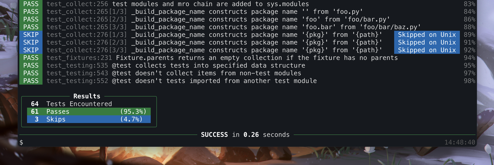

Ward
====

`Ward` is a Python testing framework with a focus on productivity and readability. It gives you the tools you need to write **well-documented** and **scalable** tests.

Features
--------
* Describe your tests using strings instead of function names
* Use plain ``assert`` statements, with no need to remember ``assert*`` method names
* Beautiful output that focuses on readability
* Manage test dependencies using a simple but powerful :ref:`fixture system <fixtures>`
* :ref:`Parameterised testing <parameterisation>` allows you to run a single test on multiple inputs
* Support for :ref:`testing async code<async_tests>`
* Supported on MacOS, Linux, and Windows
* Configurable with :ref:`pyproject.toml<pyproject>`, but works out-of-the-box with sensible defaults
* Extendable via a plugin system (coming soon)
* Speedy -- Ward's suite of ~300 tests completes in ~0.4 seconds on my machine

Installation
------------
Ward is available on PyPI, and can be installed with ``pip install ward`` (Python 3.6+ required).

A Quick Taste
-------------

Here's a simple example of a test written using Ward:

.. code-block:: python

    # file: test_example.py
    from ward import test

    @test("the list contains 42")
    def _():
        assert 42 in [-21, 42, 999]

To run the test, simply run ``ward`` in your terminal, and Ward will let you know how it went:

.. toctree::
    :maxdepth: 2
    :caption: User Guide

    guide/writing_tests
    guide/running_tests
    guide/fixtures
    guide/plugins
    guide/pyproject.toml

.. toctree::
    :maxdepth: 1
    :caption: Tutorials

    tutorials/first_tests.rst
    tutorials/testing_flask.rst

.. toctree::
    :maxdepth: 2
    :caption: Reference

    reference/testing.rst
    reference/fixtures.rst
    reference/config.rst
    reference/hooks.rst
    reference/models.rst
    reference/expect.rst
