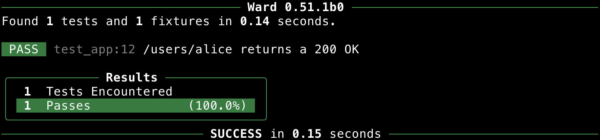
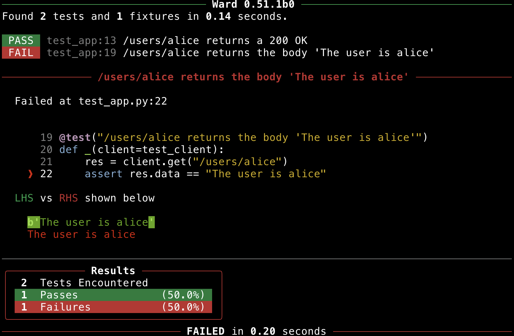
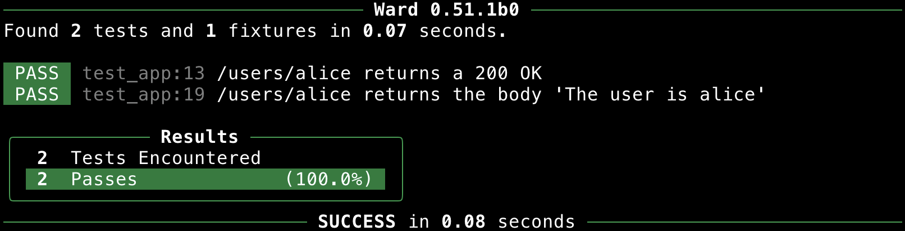

Testing a Flask App
===================

Let's write a couple of tests using Ward for the following Flask application (``app.py``).

It's an app that contains a single endpoint.
If you run this app with ``python -m app``, then visit ``localhost:5000/users/alice`` in your browser, you should see that the application returns the response ``The user is alice``.

.. code-block:: python

    # file: app.py
    from flask import Flask

    app = Flask(__name__)

    @app.route("/users/<string:username>")
    def get_user(username: str):
        return f"The user is {username}"

    if __name__ == "__main__":
        app.run()

A common way of testing Flask applications is to use the helpful ``TestClient`` class.
Using ``TestClient``, we can easily make requests to our app, and see how it behaves and responds.

Before going any further, let's install ``ward`` and ``flask``:

.. code-block:: text

    pip install ward flask

Create a new file called ``test_app.py``, and inside it, let's define a fixture to configure the Flask application for testing.
We'll inject this fixture into each of our tests, and this will allow us to send requests to our application and ensure it's behaving correctly!

.. code-block:: python

    from ward import fixture
    from app import app

    @fixture(scope="global")
    def test_client():
        app.config["TESTING"] = True  # For better error reports
        with app.test_client() as client:
            yield client

This fixture yields an instance of the ``TestClient``, which can be accessed from the Flask object we used to create our app.

We only need to create a single test client, which we can reuse across all tests in our test session,
so the ``scope`` of the fixture is set to ``"global"``.

Yielding the client from within the with statement means that any resources used by the client will be cleaned up after the test session completes.

Now we'll create our first test, which will check that our app returns the correct HTTP status code when we visit our endpoint with a valid username ("alice").
The status code we expect to see in this case is an ``HTTP 200 (OK)``.

.. code-block:: python

    from ward import fixture, test
    from app import app

    @fixture(scope="global")
    def test_client():
        app.config["TESTING"] = True  # For better error reports
        with app.test_client() as client:
            yield client

    @test("/users/alice returns an 200 OK")
    def _(client=test_client):
        res = client.get("/users/alice")
        assert res.status_code == 200

We can run our test by running ward in our terminal:

Success! It's a PASS! The fully green bar indicates a 100% success rate!

.. tip:: If we had lots of other, unrelated endpoints in our API and we only wanted to run the tests that affect the ``/users/`` endpoint, we could do so using the command ``ward --search "/users/"``.

Let's add another test below, to check that the body of the response is what we expect it to be.

.. code-block:: python

    @test("/users/alice returns the body 'The user is alice'")
    def _(client=test_client):
        res = client.get("/users/alice")
        assert res.data == "The user is alice"

Running our tests again, we see that our new test fails!

Looking at our output, we can see that while we expected the output to be The user is alice, it was actually ``b'The user is alice'``.
Ward highlights the specific differences between the expected value and the actual value to help you quickly spot bugs.

This test failed because because ``res.data`` returns a ``bytes`` object, not a string like our we thought when we wrote our test. Let's correct the test:

.. code-block:: python

    @test("/users/alice returns the body 'The user is alice'")
    def _(client=test_client):
        res = client.get("/users/alice")
        assert res.data == b"The user is alice"

If we run our tests again using ``ward``, we see that they both PASS!

